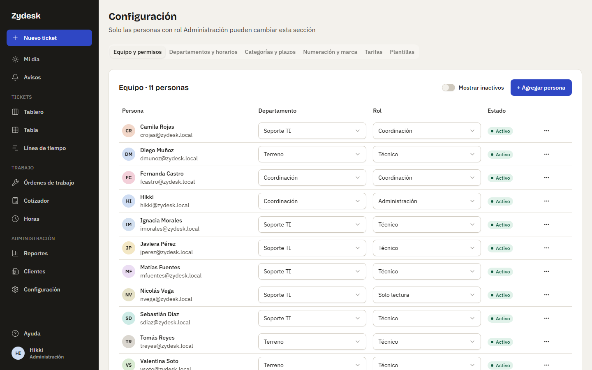
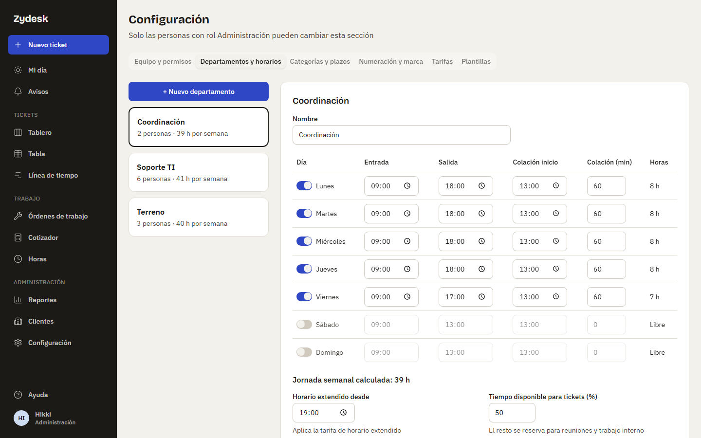
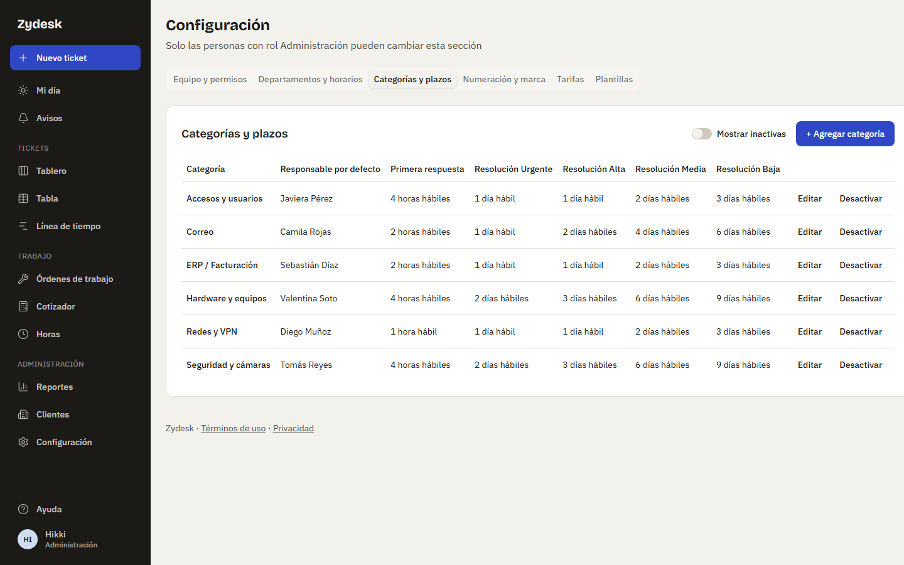
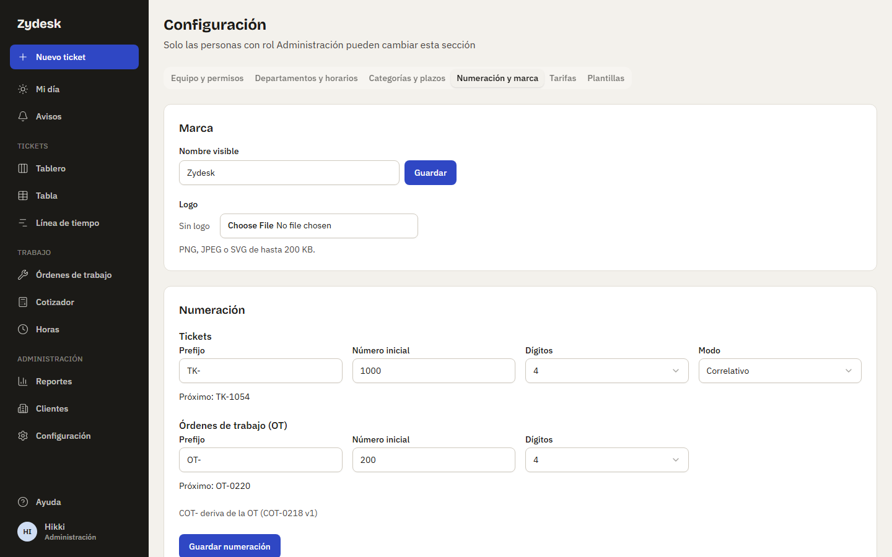
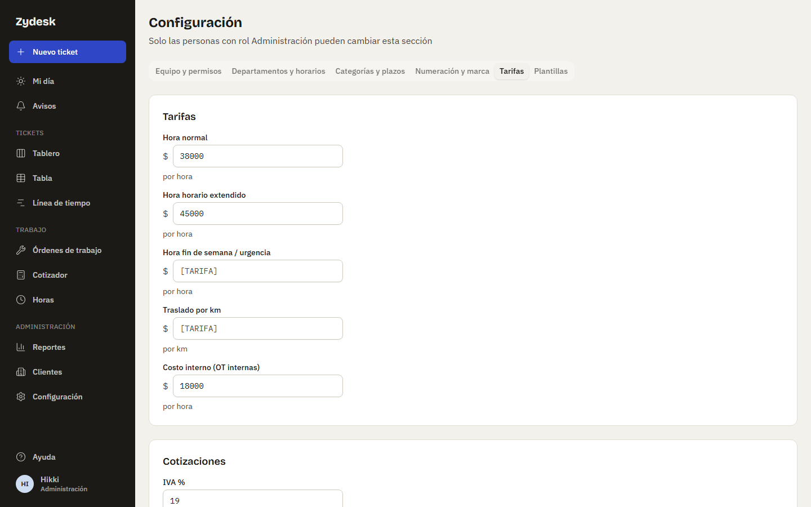
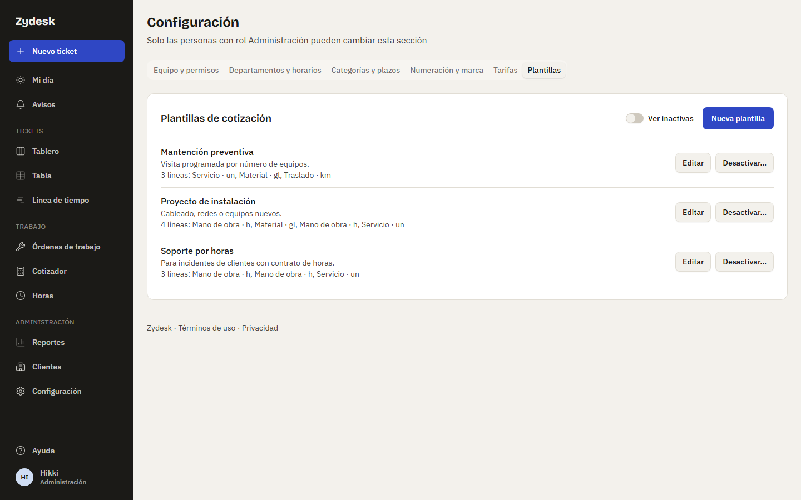

# Manual de administración

Para las personas con rol **Administración**. Explica cómo dejar la aplicación lista y cómo mantener la configuración sin ayuda del desarrollador. Las capturas de pantalla se agregarán en la Fase 8.

Casi todo se hace en **Configuración** (menú lateral o, en el celular, botón **Más**). Esa sección solo aparece para Administración.

## 1. Primer ingreso y primer usuario

La primera cuenta de Administración no se crea desde la pantalla, porque todavía no hay nadie que pueda ingresar. La crea quien instala la aplicación, una sola vez, con un comando:

1. En el archivo `.env` se escribe la contraseña inicial en la línea `ADMIN_PASSWORD=` (mínimo 10 caracteres, distinta del correo y no una contraseña común).
2. Se ejecuta (cambiando el correo y el nombre por los reales):

   ```
   npm run db:admin -- --correo admin@ejemplo.cl --nombre "Nombre Apellido"
   ```

3. Si falta `ADMIN_PASSWORD`, el comando se detiene con un error y no crea nada.
4. Con ese correo y contraseña se ingresa en la pantalla **Ingresar**. La app pide aceptar los Términos de uso la primera vez. Esta cuenta no obliga a cambiar la contraseña, pero conviene cambiarla desde **Perfil** y borrar después el valor de `ADMIN_PASSWORD` del `.env`.

Desde entonces, las demás cuentas se crean desde la pantalla (sección 2).

## 2. Crear cuentas y roles

En **Configuración → Equipo y permisos**:



1. Pulsa **+ Agregar persona**.
2. Escribe nombre, correo (es el identificador para ingresar; la app **no envía correos**), rol y departamento.
3. La app genera una **contraseña temporal** y la muestra **una sola vez**. Pulsa **Copiar** y entrégasela a la persona por un medio seguro (en persona o por mensaje directo). Si la pierdes, deberás restablecerla (sección 3).
4. La persona, al ingresar, debe aceptar los términos y elegir su propia contraseña.

Para cambiar el rol o el departamento de alguien, usa los selectores de su fila. **Cambiar el rol cierra las sesiones abiertas de esa persona**: tendrá que ingresar de nuevo.

### Qué puede hacer cada rol

| Acción                               | Administración | Coordinación | Técnico | Solo lectura |
| ------------------------------------ | :------------: | :----------: | :-----: | :----------: |
| Crear y editar tickets               |       ✓        |      ✓       |    ✓    |      –       |
| Registrar seguimiento y notas        |       ✓        |      ✓       |    ✓    |      –       |
| Asignar responsables                 |       ✓        |      ✓       |    ✓    |      –       |
| Convertir ticket en OT               |       ✓        |      ✓       |    ✓    |      –       |
| Cotizar (crear, editar, enviar)      |       ✓        |      ✓       |    ✓    |      –       |
| Aprobar cotizaciones y OT internas   |       ✓        |      ✓       |    –    |      –       |
| Cerrar OT                            |       ✓        |      ✓       |    –    |      –       |
| Marcar OT como facturada             |       ✓        |      ✓       |    –    |      –       |
| Ver reportes y montos                |       ✓        |      ✓       |    –    |      ✓       |
| Ver horas de todo el equipo          |       ✓        |      ✓       |    –    |      –       |
| Cambiar configuración (esta sección) |       ✓        |      –       |    –    |      –       |

Algunas de estas acciones llegan en fases posteriores; la matriz ya está aplicada. El **bot de Telegram** actúa con la sesión de cada persona y respeta esta misma matriz: desde el chat nadie puede hacer más de lo que puede en la web. **Registrar horas** en la planilla va con "Crear y editar tickets" (cada persona registra solo las suyas); **Ver horas de todo el equipo** permite abrir la planilla de cualquier persona en solo lectura, sin editarla. **Ver reportes y montos** abre la pantalla **Reportes** y su exportación, y es lo que muestra los montos en pesos de los indicadores y de la columna **Neto** de la lista de **Órdenes de trabajo** (los técnicos ven «—»; el detalle de la OT y el cotizador siguen mostrando el neto a quien trabaja en ella); **Marcar OT como facturada** habilita además **Exportar para facturación (.xlsx)** y el aviso "OT cerrada y lista para facturar". Todas las personas pueden ver la lista de clientes; Técnicos y Coordinación también pueden agregar contactos a un cliente.

## 3. Restablecer una contraseña

Como no hay correo saliente, si alguien olvida su contraseña:

1. En **Equipo y permisos**, abre el menú `⋯` de su fila y elige **Restablecer contraseña**; confirma.
2. La app muestra una **contraseña temporal una sola vez**. Cópiala y entrégala a la persona.
3. Se cierran todas sus sesiones. Al ingresar con la temporal, **debe crear una contraseña nueva** antes de usar la app.

Nunca pidas ni guardes la contraseña definitiva de nadie: la temporal existe justamente para que nadie más conozca la real.

## 4. Desactivar y reactivar personas

Menú `⋯` de la fila → **Desactivar**. La persona deja de poder ingresar y se cierran sus sesiones; su historial se conserva. Para verla de nuevo en la lista, activa **Mostrar inactivos**, y usa **Reactivar** si vuelve.

La app no deja desactivar tu propia cuenta ni a la última persona con rol Administración, ni quitarle ese rol: siempre debe quedar al menos una.

## 5. Departamentos y horarios

En **Configuración → Departamentos y horarios**. Cada departamento tiene:



- **Horario por día**: entrada, salida, colación (hora de inicio y minutos) y un interruptor para marcar el día como trabajado o libre. La app calcula las horas de cada día y la **jornada semanal**.
- **Horario extendido desde**: desde esa hora se consideran "extendidas" las horas registradas (se cobra tarifa de horario extendido).
- **Tiempo disponible para tickets (%)**: el resto se reserva para reuniones y trabajo interno. Es la **capacidad semanal** del gráfico **Carga vs capacidad** de Reportes: jornada semanal del departamento × este porcentaje (por ejemplo, 41 h × 80 % = 32,8 h). Una persona sin departamento aparece "Sin jornada".

Qué afecta: el horario, la colación y los feriados se usan para **contar los plazos en horas hábiles**, para la **resolución promedio en días hábiles** de Reportes (cada día cuenta por la fracción de jornada trabajada, según el departamento del responsable principal del ticket) y para la **jornada** de la planilla de **Horas**: cada día de la planilla se compara con las horas de ese día según el horario del departamento de la persona (0 en días libres y feriados, generales o del departamento). Una persona sin departamento no tiene jornada con la que comparar. "Horario extendido desde" no marca horas automáticamente: en la planilla, "fuera de horario" es una marca que pone la persona.

Un departamento solo se puede **eliminar** si no tiene personas (activas o inactivas); si las tiene, el botón aparece deshabilitado.

## 6. Feriados

En la tarjeta **Feriados** del mismo lugar. Hay dos tipos:

- **General**: vale para todos los departamentos.
- **Solo este departamento**: marca la casilla al agregarlo.

Los feriados no cuentan como días hábiles en los plazos. La app viene con los feriados legales nacionales de 2026 y 2027.

**Revísalos cada año.** Antes de que termine el año, agrega los del siguiente y compáralos con el listado oficial (como referencia sirve `https://api.boostr.cl/holidays/{año}.json`, cambiando `{año}` por el número, por ejemplo 2028). Los feriados pueden cambiar por ley durante el año, por lo que conviene volver a mirar. Si no hay feriados cargados para un año, los plazos tratarán esos días como hábiles.

## 7. Clientes, contactos, bolsa de horas y tarifas

En el menú **Clientes**. Los clientes y las **áreas internas** (por ejemplo, Marketing) se muestran en grupos separados. Puedes buscar por nombre o por RUT (con o sin puntos y guion).

- **Nuevo cliente** (solo Administración): el nombre es obligatorio y único; el RUT, si se escribe, debe ser válido y no repetirse. En un área interna no se piden RUT, dirección ni condiciones de pago.
- **Desactivar** un cliente lo oculta de la lista (se ve con **Mostrar inactivos**); los clientes nunca se borran, porque los tickets futuros los usarán.
- **Contactos**: personas del cliente con su área, correo, teléfono y si **aprueban cotizaciones**. Pueden agregarlos Administración, Coordinación y Técnicos.
- **Bolsa de horas** (opcional): un contrato mensual de horas de soporte. Se agrega con **Agregar bolsa** (Administración o Coordinación): horas al mes, fecha desde la que rige y, si corresponde, hasta cuándo y fecha de renovación. Solo puede haber **una vigente a la vez**: si las fechas se solapan con otra, la app avisa. Para renovar, cierra el contrato anterior poniéndole fecha de término y agrega el nuevo. La ficha muestra las **horas usadas este mes** del contrato vigente: la suma de las horas registradas en las OT que descuentan de esa bolsa en el mes en curso.
- **Tarifas por cliente**: en **Editar tarifas** se fijan valores propios para hora normal, horario extendido, fin de semana/urgencia y traslado por km. Si dejas marcada **Usar tarifa global**, el cliente usará la tarifa general de **Configuración → Tarifas** (sección 14). Los montos se entienden **más IVA**. La aplicación no trae tarifas cargadas: las define cada organización.

## 8. Categorías y plazos

En **Configuración → Categorías y plazos**. Cada categoría (por ejemplo "Correo" o "Redes") tiene:



- **Responsable por defecto**: quién recibe por defecto los tickets de esa categoría (una persona activa).
- **Plazo de primera respuesta**: un solo plazo, en horas o días.
- **Plazo de resolución** para cada prioridad: Urgente, Alta, Media y Baja.

Los plazos se cuentan en **horas hábiles**: el reloj solo corre dentro del horario del departamento, sin la colación y sin feriados ni días libres. Por eso "1 día hábil" no equivale a 24 horas seguidas.

Al crear o editar una categoría, la **vista previa** dice cuándo vencería un ticket de prioridad Alta si entrara ahora. Úsala para comprobar que los plazos tengan sentido. Las categorías no se borran: se **desactivan** (y se ven con **Mostrar inactivas**).

## 9. Numeración y marca

En **Configuración → Numeración y marca**.



**Marca**: el nombre visible de la aplicación (aparece en la pantalla de ingreso) y un logo opcional (PNG, JPEG o SVG de hasta 200 KB).

**Numeración** de tickets y órdenes de trabajo (OT): prefijo (por ejemplo `TK-`), número inicial, cantidad de dígitos (de 3 a 8) y, solo para tickets, el modo. Reglas:

- Los cambios **solo afectan a códigos futuros**; nunca se renumera lo ya creado.
- El **número inicial** debe ser mayor que el último usado; si no, la app lo rechaza.
- Si bajas los **dígitos** y algún número existente no cabe, la app lo rechaza. Si un número supera los dígitos, simplemente crece (`TK-123456`).
- **Modo correlativo**: 1000, 1001, 1002…
- **Modo aleatorio** (solo tickets): los números no revelan cuántos tickets hay. La pantalla muestra "usados / capacidad" y advierte al superar el 50 %; al llegar al 95 % no se podrán crear tickets hasta aumentar los dígitos. En este modo, un número mayor no significa un ticket más reciente: se ordena por fecha.
- Las OT siempre son correlativas. Las cotizaciones derivan de su OT (`COT-0218 v1`).

La tarjeta **Historial de cambios de numeración** lista quién cambió qué y cuándo.

## 10. Ingresos y registro de seguridad

En **Equipo y permisos**, el enlace **Ver ingresos y registro de seguridad** abre una tabla con: ingresos correctos y fallidos, cuentas bloqueadas, cierres de sesión, cambios y restablecimientos de contraseña, altas, bajas y cambios de rol de personas, aceptación de términos, cambios de configuración (también tarifas y plantillas), descargas de documentos y cotizaciones, exportaciones de OT para facturación y de Reportes (con los nombres de los filtros usados, sin montos) y vinculaciones de Telegram (vinculado, intento fallido por código o por clave del bot, desvinculado; con el identificador del chat, nunca el código). Cada fila guarda fecha y hora, persona, dirección IP y un detalle (por ejemplo, el navegador). Nunca se guardan contraseñas.

Puedes filtrar por acción, persona, correo y fechas. **Estos registros se conservan 1 año** y luego se borran automáticamente. No se pueden editar ni borrar desde la app.

Protecciones automáticas: tras 5 intentos fallidos seguidos la cuenta se bloquea un tiempo que va aumentando, y una misma dirección tiene un máximo de 20 intentos cada 15 minutos.

## 11. Términos y privacidad

Los textos están en los archivos `docs/legal/terminos-de-uso.md` y `docs/legal/politica-de-privacidad.md`, y se ven en la app en `/terminos` y `/privacidad`. **Hoy son borradores** con textos marcador (por ejemplo `[RESPONSABLE DEL TRATAMIENTO]`); deben ser revisados por quien corresponda antes de cargar datos reales.

Cada persona acepta una sola vez ambos documentos. Para pedir una nueva aceptación a todo el equipo: edita el texto, cambia la línea `version:` al inicio de `terminos-de-uso.md` y vuelve a iniciar la API. Todas las personas verán el diálogo de aceptación. Más detalles en `docs/legal/README.md`.

## 12. Tickets: archivos, correos y archivado

**Dónde se guardan los archivos.** Las fotos, documentos y correos de los tickets se guardan en disco, en la carpeta indicada por `ARCHIVOS_DIR` en el archivo `.env` (por defecto `./datos/archivos`, dentro del repositorio; también puede ser una ruta absoluta). Dentro se organizan por año y mes (`aaaa/mm/`) con nombres aleatorios: el nombre original solo se guarda en la base de datos. La carpeta `datos/` no se versiona. **Respáldala junto con la base de datos**: si falta un archivo en disco, el ticket sigue existiendo pero la descarga falla. Si cambias `ARCHIVOS_DIR`, mueve antes el contenido y reinicia la API.

**Límites.** Hasta 10 archivos por subida y 20 MB cada uno. Tipos permitidos: JPG, PNG, WebP, HEIC, PDF, Word, Excel, PowerPoint, ZIP, `.eml`, `.msg`, `.txt` y `.csv`. La app revisa el contenido real del archivo, no solo la extensión: un ejecutable renombrado como `.png` se rechaza.

**Archivos huérfanos.** Un archivo subido que nunca se usó en un ticket, seguimiento o nota (por ejemplo, alguien abandonó el formulario) se elimina automáticamente a las 24 horas; la tarea corre cada noche a las 04:00 (hora de Santiago).

**Espacio en disco.** Los archivos de tickets no se borran solos. Revisa de vez en cuando el tamaño de `ARCHIVOS_DIR` y el espacio libre del disco. Las fotos tomadas desde el celular se comprimen antes de subir y pesan alrededor de 0,5 MB cada una.

**Descargas.** Cualquier persona con sesión puede ver y descargar los archivos de los tickets. Las descargas de documentos y correos (no las fotos ni los PDF que se abren en pantalla) quedan en el registro de seguridad.

**Archivado de tickets.** Un ticket cerrado (Resuelto, Descartado o Duplicado) se archiva solo a los 7 días; la tarea corre cada noche a las 03:10 (hora de Santiago). Archivado significa que sale del Tablero y se ve en la Tabla, filtro **Archivados**; no se borra nada y se puede reabrir. El estado de un ticket se cambia únicamente desde su detalle (el Tablero y la Tabla son de solo lectura).

**Crear tickets desde correos.** No hay un buzón conectado: la persona arrastra un `.eml`/`.msg` o pega el texto del correo al crear el ticket (ver el [manual de tickets](usuario/01-tecnico.md)).

## 13. Órdenes de trabajo

**Numeración.** Las OT (`OT-0218`) siempre son correlativas y se configuran en **Configuración → Numeración y marca**, igual que los tickets (sección 9). El número inicial debe ser mayor que el último usado; los cambios solo afectan a códigos futuros. Una conversión que falla no consume número.

**Quién puede qué** (matriz de la sección 2):

- **Convertir un ticket en OT, editarla, cambiar sus etapas simples** (volver a borrador, iniciar ejecución), **cotizarla** (crear, editar, importar horas, aplicar plantilla, marcar como enviada, duplicar) y **gestionar sus tareas, mensajes y archivos**: quien puede editar tickets (Administración, Coordinación y Técnico). La OT pasa a Cotizada solo al marcar una cotización como enviada; no hay marca manual.
- **Aprobar** (OT interna y aprobación del cliente de una facturable): permiso de aprobar (Administración y Coordinación). La persona elegida como "quién aprueba" debe tener ese permiso; con todo, cualquiera que lo tenga puede aprobar.
- **Cerrar** y **cancelar**: permiso de cerrar OT (Administración y Coordinación). Cancelar se considera una forma de cierre.
- **Marcar como facturada**: permiso de facturar (Administración y Coordinación).
- **Solo lectura** ve todas las OT, sus notas internas y sus archivos, sin poder cambiar nada.

**Ticket y OT.** Mientras un ticket tenga una OT abierta (que no esté Cerrada ni Cancelada) no se puede resolver, descartar ni marcar como duplicado. Si hay que desbloquearlo, se cierra o cancela la OT.

**Facturación.** Una OT facturable cerrada queda **Por facturar** aunque no haya resuelto el ticket; al cancelarla pasa a "No aplica". Marcar como facturada solo registra el número de factura: la app no emite documentos tributarios.

**Bolsa de horas.** La casilla **Descuenta de la bolsa** de una OT solo aparece si el cliente tiene una bolsa vigente (sección 7). La OT y la ficha del cliente muestran las horas usadas en el mes por las OT que descuentan de esa bolsa.

**Archivos de OT.** Las fotos y documentos de las OT se guardan en la misma carpeta `ARCHIVOS_DIR` y con las mismas reglas que los de los tickets (sección 12): mismos tipos, límites, huérfanos de 24 horas y respaldo. Cualquier persona con sesión puede verlos y descargarlos; las descargas de documentos y correos quedan en el registro de seguridad. Al copiar un mensaje de la OT al ticket no se duplican los archivos.

**Horas.** Las horas de una OT se registran desde el redactor o desde la planilla **Horas** (ver [manual de tickets](usuario/01-tecnico.md#registrar-horas)), opcionalmente contra una tarea; una OT cerrada o cancelada no admite más horas. La planilla no deja rastro en el historial de la OT ni en el registro de seguridad: el registro es la propia fila de horas.

**Indicadores y exportación.** La lista **Órdenes de trabajo** muestra arriba Por facturar, Esperando al cliente, En ejecución y Horas internas del mes; los montos en pesos solo con **Ver reportes y montos**. **Exportar para facturación (.xlsx)** (permiso de facturar) descarga las OT filtradas y deja una fila "Exportación" en el registro de seguridad (sección 10). La columna **Neto** de la lista también exige **Ver reportes y montos** (los técnicos ven «—»); el detalle de la OT y el cotizador siguen mostrando el neto a quien trabaja en ella. Las cifras agregadas (facturado en el período, por facturar hoy, horas) están en **Reportes** (ver el [manual de coordinación](usuario/02-coordinacion.md#reportes)).

**Lo que todavía no existe.** Exportación de la planilla de horas en bruto (Reportes exporta las horas agregadas por semana). Las listas `/ots` y `/cotizaciones` son vistas de solo lectura.

Los manuales de uso son el [manual de tickets](usuario/01-tecnico.md) y el [manual de coordinación](usuario/02-coordinacion.md).

## 14. Tarifas, IVA y validez

En **Configuración → Tarifas**. Dos tarjetas y un solo botón **Guardar**:



- **Tarifas** globales: hora normal, horario extendido, fin de semana/urgencia, traslado por km y **costo interno (OT internas)**, en pesos enteros más IVA. Un campo vacío es una tarifa **sin definir**: se muestra como `[TARIFA]`. Las tarifas por cliente (sección 7) tienen prioridad sobre estas.
- **Cotizaciones**: **IVA %** (por defecto 19), **validez por defecto** (15 o 30 días) y **condiciones comerciales por defecto**, que cada cotización nueva copia al crearse.

Qué afecta:

- **Importar horas** en el Cotizador usa la tarifa de hora normal del cliente o, si no tiene, la global. Si ninguna está definida, la importación se detiene y pide configurarla aquí. Con origen **registradas**, las horas marcadas fuera de horario usan la tarifa de **horario extendido** (del cliente o la global), que también debe estar definida si hay horas de ese tipo. Lo mismo para las líneas de plantilla sin precio (hora normal para `h`, traslado para `km`).
- **Cambiar el IVA solo afecta a cotizaciones nuevas**: cada cotización guarda el porcentaje con que nació y lo conserva al duplicarse.
- **Costo interno**: las OT internas muestran horas registradas × esta tarifa. Sin ella, la tarjeta pide configurarla.

Cada guardado queda en el registro de seguridad (sección 10) con los campos que cambiaron, sin los montos.

## 15. Plantillas de cotización

En **Configuración → Plantillas**. Una plantilla tiene nombre (único), descripción, condiciones comerciales opcionales y hasta 50 líneas (tipo, descripción, cantidad, unidad, precio unitario opcional y descuento %). **Nueva plantilla** las crea; **Editar** las cambia (las cotizaciones que ya la aplicaron no se tocan).



- **Precio vacío = tarifa vigente al aplicar**: así una subida de tarifas no obliga a editar las plantillas. Las líneas de materiales y gastos sin precio quedan en 0 para completarlas en la cotización.
- Las plantillas no se borran: **Desactivar…** (con confirmación) las saca de la lista del Cotizador; **Ver inactivas** las muestra y **Reactivar** las devuelve.
- Al aplicar una plantilla a una cotización sin condiciones comerciales, se copian las de la plantilla.

La app trae tres plantillas de ejemplo solo en las semillas de desarrollo.

## 16. Avisos

Los avisos en la app no se configuran desde **Configuración**: cada persona maneja los suyos en **Avisos → Preferencias** (ver [Primeros pasos](usuario/00-primeros-pasos.md#avisos)). Lo que conviene saber:

- **Valores por defecto.** Sin preferencia guardada, los ocho tipos de aviso están activos **en la app**. Para **Telegram** vienen activos salvo "Cambia el estado de un ticket que sigo" y "Nuevo seguimiento en un ticket que sigo"; el **Resumen diario** solo existe por Telegram. Telegram solo envía a quien vinculó su cuenta (sección 17); sin bot configurado la tarjeta de Telegram no se muestra.
- **Quién recibe qué.** Los avisos llegan a quien tiene relación con el ticket o la OT (responsables, seguidores, mencionados, la persona que debe aprobar). "OT cerrada y lista para facturar" llega a todas las personas activas con permiso de facturar (Administración y Coordinación). Nadie recibe aviso de su propia acción y una persona desactivada no recibe nada.
- **Sin contenido sensible.** El texto de un aviso lleva códigos, asuntos, nombres y etiquetas de estado; nunca el texto de mensajes o notas, motivos de cierre o cancelación ni montos.
- **Vencimientos.** Una tarea automática revisa cada 30 minutos los tickets abiertos: avisa al responsable principal cuando faltan menos de 24 horas para la fecha límite y cuando ya pasó (una sola vez por ticket y fecha; si la fecha límite cambia, avisa de nuevo). Si la API corre con `EJECUTAR_JOBS=false`, estos avisos no se generan.
- **Registro.** Los avisos no dejan rastro en el historial del ticket ni en el registro de seguridad: la fila del aviso es el registro. Los avisos **leídos** hace más de 90 días se borran cada noche a las 03:00 (hora de Santiago); el historial del ticket o la OT no cambia.

## 17. Bot de Telegram

El bot lleva los avisos a Telegram y deja usar algunos comandos desde el chat, siempre con la cuenta de cada persona (ver el [manual del bot](usuario/04-bot-telegram.md)). Son dos procesos: la **API** envía los avisos y valida las vinculaciones, y el **bot** (`apps/bot`) atiende los comandos. Ambos leen el mismo `.env`. Sin configurarlo, la app funciona igual: la tarjeta de Telegram no aparece y nada sale de la app.

**Crear el bot con @BotFather** (una vez; en producción se crea un bot distinto al de desarrollo):

1. En Telegram abre **@BotFather**, envía `/newbot`, elige el nombre visible y el **usuario** (debe terminar en `bot`, por ejemplo `zydesk_miempresa_bot`). BotFather devuelve el **token**: trátalo como una contraseña.
2. Opcional pero recomendado: `/setcommands` con la lista que el bot registra solo al arrancar (`hoy`, `mis`, `ticket`, `vincular`, `desvincular`, `ayuda`), por si quieres editar las descripciones; `/setdescription` y `/setabouttext` con un texto que diga que es el bot de la organización. En `/setprivacy` deja el modo de privacidad **activado** (el bot solo atiende chats privados y no necesita leer grupos). No lo agregues a grupos: los ignora.
3. Escribe el token en `.env`, en `TELEGRAM_BOT_TOKEN=`, y el usuario sin `@` en `TELEGRAM_BOT_USUARIO=`. **El token va solo en el `.env` del servidor**: nunca en el repositorio, en un chat ni en un ticket. Si se filtra, revócalo en BotFather (`/revoke`) y pon el nuevo.

**Variables** (todas en `.env`; detalles en `.env.example`):

| Variable               | Quién la usa | Qué es                                                                                                                                                                                                                                                                                                                                                       |
| ---------------------- | ------------ | ------------------------------------------------------------------------------------------------------------------------------------------------------------------------------------------------------------------------------------------------------------------------------------------------------------------------------------------------------------ |
| `TELEGRAM_BOT_TOKEN`   | API y bot    | El token de BotFather. Sin él la vinculación no se ofrece, los envíos quedan "omitidos" y el proceso del bot termina solo al arrancar.                                                                                                                                                                                                                       |
| `TELEGRAM_BOT_USUARIO` | API          | El usuario del bot sin `@`. Arma el enlace **Abrir en Telegram** y el QR del diálogo de vinculación; sin él solo se muestra el código.                                                                                                                                                                                                                       |
| `BOT_API_KEY`          | API y bot    | Clave compartida entre ambos procesos: autentica la única ruta que usa el bot sin sesión de una persona (`POST /api/bot/vincular`) y firma los códigos de vinculación guardados en la base. Obligatoria con el token; en producción **mínimo 32 caracteres** y distinta del valor de ejemplo (la API no arranca si no): genera una con `openssl rand -base64 32`. |
| `WEB_URL`              | API y bot    | La dirección de la web que llevan los enlaces de los mensajes. En producción debe ser `https://` (la API no arranca con `http://`); Telegram solo hace clicables los enlaces `https`.                                                                                                                                                                      |
| `API_URL`              | bot          | Dónde está la API para el bot: `http://localhost:3010` en desarrollo, la dirección interna (`http://api:3000`) en Docker; nunca el dominio público (el bot lo advierte en el log).                                                                                                                                                                           |
| `BOT_DATOS_DIR`        | bot          | Carpeta del archivo `sesiones.json.enc` con las sesiones de los chats (por defecto `./datos/bot`). **Respáldala** o acepta que, si se pierde, todas las personas vuelven a vincular (los avisos siguen llegando; solo los comandos exigen la sesión).                                                                                                      |
| `BOT_CLAVE_CIFRADO`    | bot          | 32 bytes en base64 con los que se cifra ese archivo (AES-256-GCM). Obligatoria con el token. Genera una con `openssl rand -base64 32` y guárdala junto con el resto de secretos.                                                                                                                                                                             |

**Qué pasa si rotas cada clave:**

- `TELEGRAM_BOT_TOKEN`: reinicia la API y el bot. Las vinculaciones no cambian (dependen del chat, no del token) mientras sea el **mismo bot**; si cambias a otro bot, todas las personas deben vincular de nuevo.
- `BOT_API_KEY`: reinicia la API y el bot con el mismo valor en ambos (si difieren, el bot responde "Zydesk no responde ahora" al vincular y la API registra fallos de clave). Los códigos de vinculación vigentes dejan de valer (duran 10 minutos de todos modos); las vinculaciones y las sesiones del bot no se tocan.
- `BOT_CLAVE_CIFRADO`: el bot no puede leer el archivo anterior, lo registra como error y arranca vacío. Las personas siguen recibiendo avisos, pero para usar comandos deben enviar `/vincular` con un código nuevo.

**Seguridad y límites.** El código de vinculación tiene 8 caracteres, vale 10 minutos y una sola vez, y en la base se guarda solo su hash. Una persona puede pedir hasta 5 códigos cada 15 minutos; un chat que falla 5 códigos en 15 minutos queda bloqueado un rato; una dirección que falla 20 veces la clave del bot en 15 minutos también. Pedir un código exige estar en la web con sesión (no se puede desde el propio bot). Un chat de Telegram solo puede estar vinculado a una cuenta. El bot nunca usa la base de datos: habla solo con la API, con la sesión de cada persona.

**Sesiones del bot y personas.** Cada vinculación crea una sesión **Bot de Telegram** (visible en Perfil → Sesiones activas de la persona) que dura 30 días sin uso o 90 en total. Cambiar la contraseña, cambiar el rol o desactivar a una persona cierra también esa sesión; la vinculación se conserva, pero una persona **desactivada no recibe nada** (al reactivarla vuelve a recibir avisos y debe enviar `/vincular` para usar comandos). Desvincular borra el vínculo y la sesión. Las vinculaciones, los intentos fallidos y las desvinculaciones quedan en el registro de seguridad (sección 10).

**Si algo no llega.** Comprueba que la API corra con `EJECUTAR_JOBS=true` (la cola de envío y el resumen diario son tareas programadas) y que el token siga válido (si Telegram lo rechaza, el bot termina con un error en el log). Cada envío queda en la tabla `aviso_envio` con su estado: `enviado`, `fallido` (Telegram lo rechazó de forma definitiva, por ejemplo la persona bloqueó al bot, o se agotaron los 3 reintentos), `omitido` (`sin_vinculo`: la persona no está vinculada; `sin_token`: la API no tiene `TELEGRAM_BOT_TOKEN`) o `pendiente` (en cola; los pendientes de más de una hora se vuelven a encolar cada noche). Los logs de la API y del bot registran solo identificadores: nunca el texto de los avisos, el código, el token ni el identificador del chat.

## 18. Referencia de la API

Para integraciones: con sesión de Administración, abre `/api/docs` (por ejemplo `http://localhost:3010/api/docs`) para ver todas las rutas. La guía de uso está en `docs/api/README.md`.
