# Manual de tickets para el equipo

Esta guía es para quienes crean y atienden tickets (Administración, Coordinación y Técnicos). Quien tiene rol **Solo lectura** puede ver todo, incluidas las notas internas, pero no editar nada.

## Crear un ticket

1. Pulsa **Nuevo ticket** (en el menú o en el Tablero).
2. Completa al menos el **asunto**. El resto ayuda a atender y a calcular plazos: descripción, cliente (o área interna), solicitante, prioridad (por defecto **Media**), categoría, responsables, seguidores, inicio planificado, fecha límite y horas estimadas.
3. Si eliges una categoría y no hay responsable principal, la app **propone** el responsable por defecto de esa categoría; puedes cambiarlo.
4. Si dejas la **fecha límite** vacía y hay categoría y responsable principal con departamento, se calcula sola según los plazos de la categoría (en horas hábiles). Bajo el campo verás "Se calculará: vence el …". Si escribes una fecha, se respeta.
5. Pulsa **Crear ticket**. Te lleva al detalle del ticket nuevo.

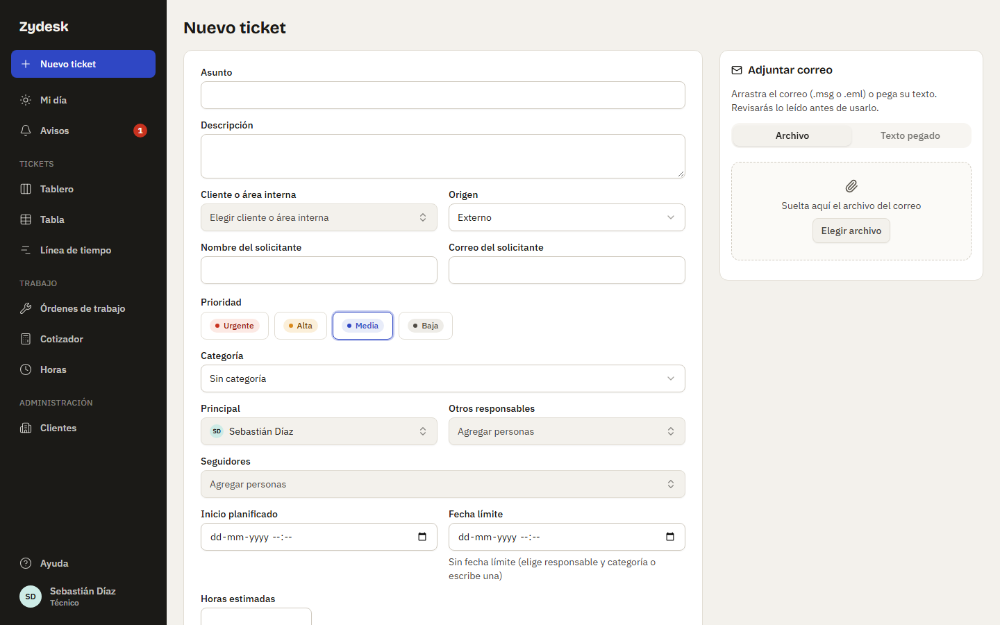

Desde la ficha de un cliente, **Nuevo ticket para este cliente** abre el formulario con el cliente ya elegido.

### Crear un ticket desde un correo

En el panel **Adjuntar correo** (a la derecha; en el celular, arriba y plegable):

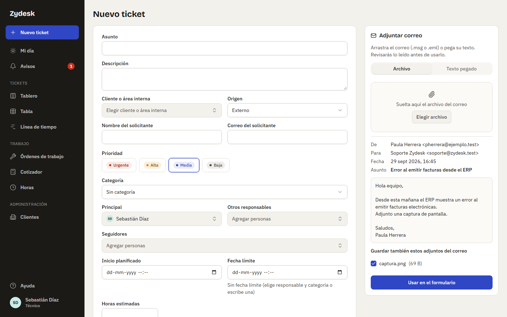

- **Archivo**: arrastra un `.eml` o un `.msg` (correo guardado desde el programa de correo).
- **Texto pegado**: pega el correo completo, con las líneas De/Para/Asunto, y pulsa **Leer correo**.

Verás una vista previa con De, Para, Fecha, Asunto y cuerpo. Si el correo trae adjuntos, aparecen con una casilla marcada: desmarca los que no quieras guardar (los no permitidos vienen deshabilitados). Pulsa **Usar en el formulario**: se rellenan el asunto, el solicitante y la descripción. Revisa los datos y crea el ticket.

En el detalle queda la tarjeta **Correo original**, con botón **Descargar original**, y los adjuntos que elegiste como archivos del ticket. Si el correo no se puede leer, pega su texto en la otra pestaña.

## Archivos y fotos

Puedes adjuntar fotos y documentos al crear el ticket y en cada seguimiento o nota (en el celular, el botón de cámara abre la cámara). Se aceptan imágenes (JPG, PNG, WebP, HEIC), PDF, Word, Excel, PowerPoint, ZIP, `.eml`, `.msg`, `.txt` y `.csv`; hasta 10 archivos por vez y 20 MB cada uno. Un archivo de otro tipo, o que no es lo que dice su extensión, se rechaza.

Cada foto aparece al instante como **vista previa** mientras sube, con su estado: «Subiendo…», lista, o con error y un botón **Reintentar** (vuelve a subir la misma foto, sin sacarla de nuevo). Un contador indica «2 de 3 fotos subidas». Antes de enviar puedes **Quitar** cualquiera. Las fotos se comprimen en tu celular antes de subir (quedan en unos 0,5 MB). Una foto **HEIC** (formato de iPhone) se guarda, pero algunos navegadores no la muestran: en ese caso se ve como un documento con su nombre, no como imagen.

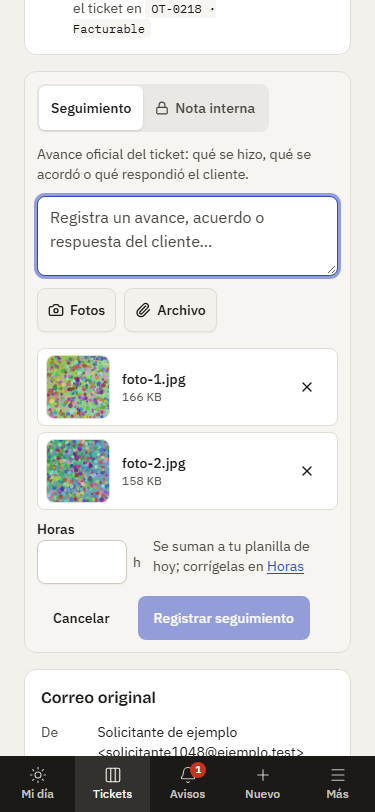

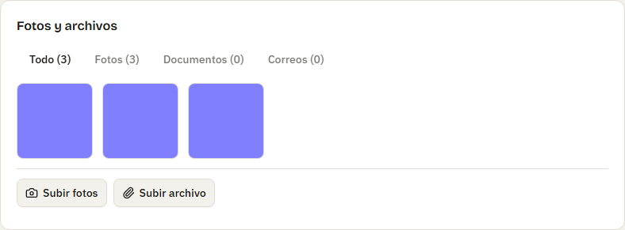

## El detalle del ticket

Arriba ves el código, el asunto, el estado, la prioridad, la fecha límite y los botones **Cambiar estado** y **Editar**. Debajo: descripción, correo original, archivos, tareas y la **actividad**. A la derecha están los datos del ticket: responsables, seguidores, solicitante, cliente, categoría, fechas y primera respuesta. **Seguir** te agrega como seguidor; **Dejar de seguir** te quita.

**En el celular** el orden cambia para que lo de terreno quede a mano: bajo el título hay una fila de **atajos** (Datos · Descripción · Tareas · Actividad · Archivos); **Datos del ticket** va arriba, **plegado**, con el cliente y los responsables en el resumen (tócalo para ver el estado con **Cambiar**, la prioridad, las fechas y las OT vinculadas); luego Descripción, Tareas y Actividad; al pie, la barra **Escribir seguimiento** con el botón de cámara; y al final, Correo original y Archivos del ticket.

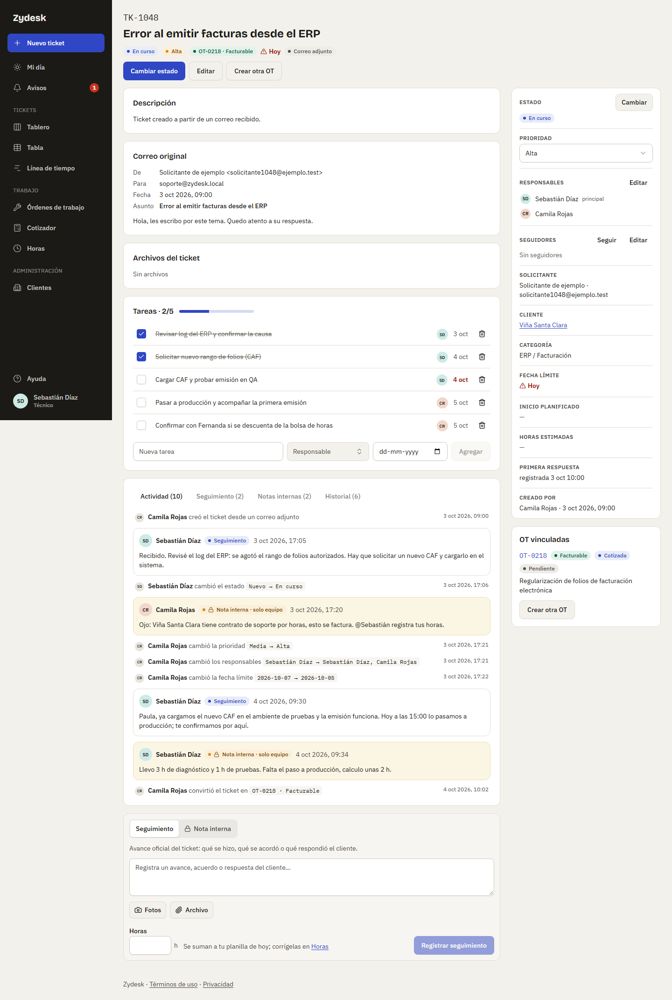

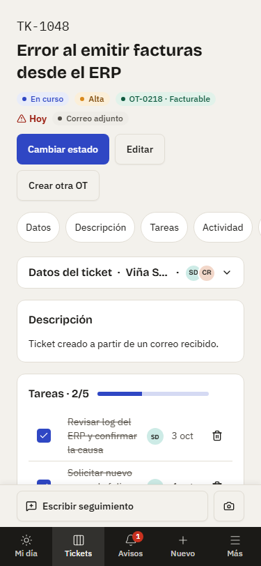

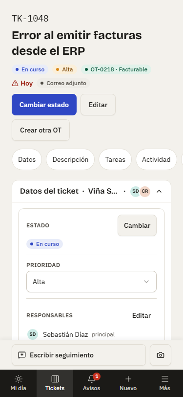

## Seguimiento o nota interna

El redactor del pie tiene dos modos:

- **Seguimiento**: avance oficial del ticket: qué se hizo, qué se acordó, qué respondió el cliente. El primer seguimiento registra la primera respuesta del ticket.
- **Nota interna**: contexto solo para el equipo. Se ve con fondo ámbar y candado, y no debe incluirse en reportes al cliente.

Ambos se pueden registrar aunque el ticket esté cerrado o archivado (no lo reabren). El texto se guarda tal cual, sin formato.

En el celular el redactor está **plegado** en una barra al pie: **Escribir seguimiento** lo abre (el cuadro de texto queda a la vista, con foco) y el botón de **cámara** lo abre y dispara la cámara de una vez. El modo (Seguimiento o Nota interna) se elige dentro. **Cancelar** vuelve a plegarlo; si ya escribiste algo o adjuntaste fotos, pide confirmación antes de descartarlo. Al registrar, la barra vuelve a plegarse y el mensaje queda en Actividad.

En **Actividad** hay pestañas con conteos: **Actividad** (todo), **Seguimiento**, **Notas internas** e **Historial** (cambios de estado, prioridad, responsables, fechas y tareas, con quién y cuándo).

## Menciones

Escribe `@` en el redactor y elige a una persona activa de la lista. Su nombre queda resaltado en el mensaje y la persona recibe un aviso ("Camila Rojas te mencionó en una nota interna de TK-1048") que la lleva al mensaje; el aviso no incluye el texto. Vale en seguimientos y notas internas, de tickets y de OT. Mencionarte a ti mismo no genera aviso.

## Horas desde el redactor

En el redactor puedes indicar las **horas** trabajadas (por ejemplo 1,5). Al guardar, el mensaje muestra "· 1,5 h registradas" y las horas quedan a tu nombre, con la fecha de hoy, en tu planilla de **Horas**. Si te equivocaste de día o de cantidad, corrígelas desde la planilla (ver [Registrar horas](#registrar-horas)); el mensaje no se edita.

## Registrar horas

**Horas** (menú, grupo Trabajo; en el celular, en **Más**) es tu planilla semanal. Una fila por ticket, OT (con una tarea de la OT, si quieres) o trabajo **Sin ticket** (reuniones, trabajo interno: con una descripción obligatoria), y una columna por día, de lunes a domingo. Puedes registrar horas en Administración, Coordinación y Técnico; **Solo lectura** ve su planilla vacía con el aviso "Tu rol no registra horas".

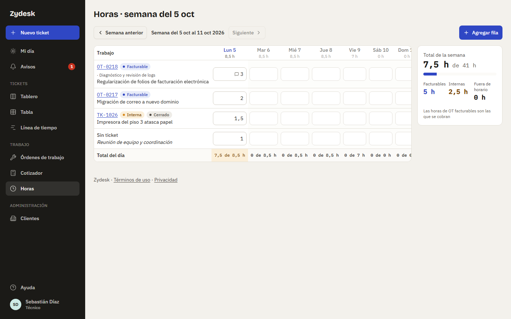

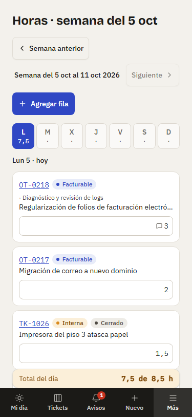

- **Semana**: con las flechas cambias de semana y **Hoy** vuelve a la actual. No se registran horas en días futuros: esas columnas quedan deshabilitadas.
- **Agregar fila**: elige Ticket, OT o Sin ticket; busca por código o título. En una OT puedes elegir una **tarea**: las horas se suman a esa tarea (columna **Reg.** en la OT). La fila nueva aparece vacía y solo se guarda cuando escribes horas; si cambias de semana sin horas, desaparece.
- **Celdas**: escribe las horas (coma o punto; en pasos de 0,25, hasta 24) y sal del campo o pulsa Enter: se guarda al momento, sin botón "Guardar". Vaciar la celda borra esas horas. El botón de luna marca la celda como **Fuera de horario** (trabajo fuera de tu jornada; se cobra a tarifa extendida en las OT facturables).
- **Totales**: cada fila suma la semana; cada día se compara con tu **jornada** (sale del horario y los feriados de tu departamento): en rojo si registraste más que la jornada, en ámbar si un día pasado quedó corto. Es solo una referencia: nada te impide guardar. Si no tienes departamento, la app lo avisa y no compara.
- **Resumen**: total de la semana frente a la jornada semanal, y cuánto fue **facturable** (OT facturables), **interno** (tickets, OT internas y Sin ticket) y **fuera de horario**.

**Horas desde un seguimiento.** Las horas que escribiste en el redactor aparecen en la celda de ese día con un ícono de mensaje; la celda no se edita directo: pulsa el total para abrir el **detalle de la celda**, que lista cada registro (manual o seguimiento, con enlace al mensaje). Ahí corriges las horas, la **fecha** y la marca "Fuera de horario" de cada uno, o lo quitas; el seguimiento se conserva y muestra el nuevo valor (o deja de mostrar horas). El detalle también sirve para agregar horas manuales a una celda que ya tiene un seguimiento.

**OT cerrada o cancelada.** No admite horas (ni nuevas ni corregir las que tiene): sus celdas quedan de solo lectura con el aviso "La OT está cerrada: no se registran horas". Un ticket cerrado sí admite horas. Si una tarea con horas se mueve a otra OT (al cerrar con nueva OT) o se quita, sus horas se quedan en la OT original, sin tarea.

**En el celular** (menos de 768 px) la planilla se muestra **por día**: los chips L · M · X · J · V · S · D (con el total de cada día) eligen el día y cada fila es una tarjeta con su campo de horas y la marca de fuera de horario; el total del día frente a la jornada queda fijo al pie.

## Tareas

La tarjeta **Tareas** es la lista de pasos del ticket, con barra de progreso ("2 de 5"). Cada tarea tiene título, responsable opcional y fecha opcional. Puedes agregar, editar y quitar tareas, y marcarlas como hechas. Una tarea pendiente con fecha pasada se ve en rojo. En un ticket cerrado solo se pueden marcar o desmarcar; para agregar, editar o quitar hay que reabrirlo.

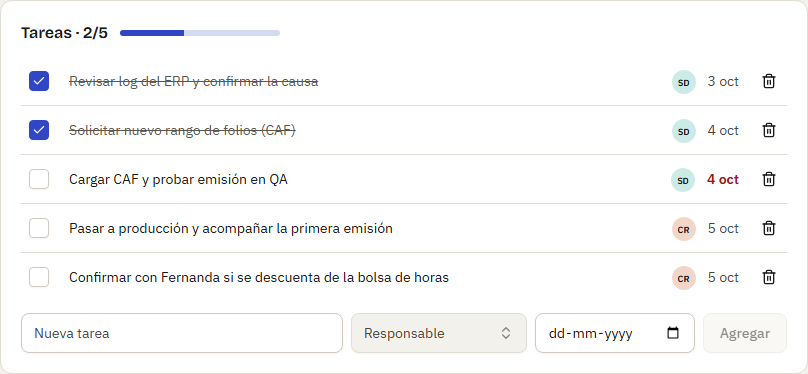

## Estados y qué exige cada uno

Desde el detalle, **Cambiar estado** abre un diálogo. **Es el único lugar donde se cambia el estado**: ni el Tablero ni la Tabla permiten arrastrar o cambiar estados.

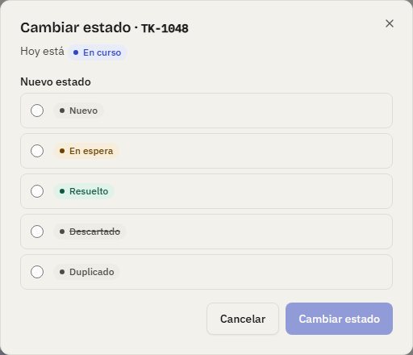

| Estado        | Qué pide                                                                               |
| ------------- | -------------------------------------------------------------------------------------- |
| **Nuevo**     | Nada. Es el estado inicial.                                                            |
| **En curso**  | Nada. La primera vez que un ticket pasa a En curso cuenta como primera respuesta.      |
| **En espera** | De quién se espera: cliente, proveedor, repuesto o aprobación, y un detalle opcional.  |
| **Resuelto**  | Nada, pero el ticket no puede tener una OT abierta (ver más abajo).                    |
| **Descartado** | Un motivo obligatorio (por ejemplo, "No corresponde: publicidad"); sin OT abierta.   |
| **Duplicado** | El ticket original (no el mismo ni otro duplicado); sin OT abierta.                    |

**Un ticket con una OT abierta no se puede resolver, descartar ni marcar como duplicado**: la app muestra la lista de OT abiertas (con su etapa y un enlace) y hay que cerrarlas o cancelarlas antes. Desde un ticket abierto puedes ir a cualquier otro estado. Desde uno cerrado (Resuelto, Descartado o Duplicado) solo a **En curso**: el botón se llama **Reabrir**. Un ticket cerrado no se puede editar (asunto, responsables, tareas) hasta reabrirlo.

## Convertir un ticket en OT

Una **orden de trabajo (OT)** es el trabajo formal que sale de un ticket: con alcance, responsable técnico, tareas con horas, fotos y, si se cobra, aprobación del cliente y facturación. Un ticket puede tener varias OT.

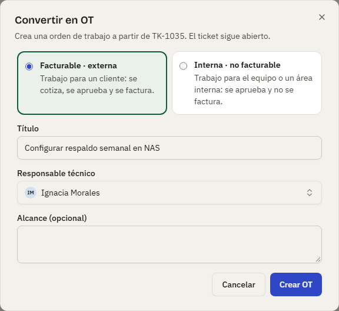

1. En el detalle del ticket pulsa **Convertir en OT** (si ya tiene una OT que no está cancelada, el botón dice **Crear otra OT**; también está en la tarjeta **OT vinculadas** del panel). En un ticket cerrado el botón está deshabilitado: reábrelo primero.
2. Elige el **tipo**: **Facturable · externa** (se cobra al cliente) o **Interna · no facturable**.
3. Revisa el **título** (viene del asunto), el **responsable técnico** (viene del responsable principal del ticket) y, si quieres, el **alcance**. Si el cliente tiene una bolsa de horas vigente y la OT es facturable, aparece la casilla **Descuenta de la bolsa**.
4. Pulsa crear. La app te lleva a la OT, que nace en **Borrador**. El estado del ticket no cambia.

## Qué pasa con las tareas

Al convertir, las **tareas pendientes** del ticket **pasan a la OT** (dejan de verse en el ticket). Las tareas **ya hechas se quedan** en el ticket como registro. El aviso del diálogo dice cuántas tareas pasarán. Al cancelar una OT, sus tareas pendientes se quedan en ella.

## La orden de trabajo

Arriba ves el código (`OT-0218`), el título, el tipo, la etapa, el ticket de origen, el responsable y el término (en rojo si ya pasó). Debajo, el avance por **etapas** y las tarjetas de la OT. A la derecha (en el celular, debajo) están la cotización, la aprobación, la facturación, el ticket de origen, las horas, los datos y el historial resumido.

**En el celular**: bajo el título, una fila de **atajos** (Etapas · Tareas · Fotos · Actividad · Cotización · Aprobación · Horas · Datos) lleva a cada sección; las etapas muestran la actual a la vista; después vienen Tareas, Fotos y archivos y Actividad, la barra **Escribir seguimiento** con cámara, el panel y, al final, **Tipo y datos** plegado (abierto solo mientras la OT está en Borrador, que es cuando se completa).

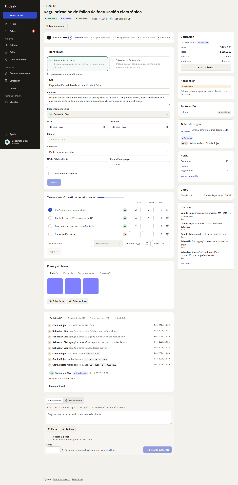

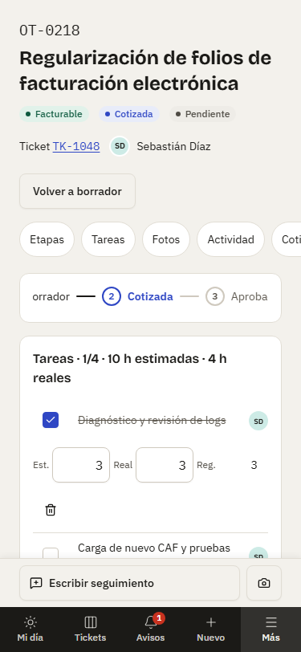

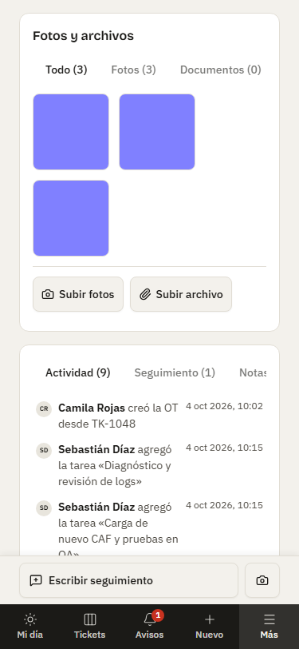

**Etapas.** Una OT facturable pasa por Borrador, Cotizada, Aprobada, En ejecución y Cerrada (y, si se cobra, **Facturada**, que se muestra como último paso). Una interna pasa por Borrador, Aprobada, En ejecución y Cerrada. Desde los botones de la OT puedes:

- **Crear cotización** o **Revisar y enviar cotización** (facturable en Borrador con cliente externo): la OT pasa a **Cotizada** sola cuando marcas la cotización como enviada (ver [Cotizar una OT](#cotizar-una-ot)). Ya no hay "Marcar como cotizada".
- **Volver a borrador** (facturable en Cotizada, por ejemplo si el cliente rechaza). Si la cotización vigente estaba enviada, queda **Rechazada** y podrás duplicarla como nueva versión.
- **Iniciar ejecución** (OT Aprobada). Si la OT no tenía fecha de inicio, queda con la de hoy.

Aprobar, cerrar, cancelar y marcar como facturada requieren permisos de Coordinación o Administración: ver el [manual de coordinación](02-coordinacion.md). Si no tienes permiso, esos botones no aparecen y, en una interna en Borrador, verás "Pendiente de aprobación de …".

**Tipo y datos.** El **tipo** y el **cliente** solo se cambian en **Borrador**. Cambiar el tipo limpia los campos del otro tipo (la app te pide confirmar). Una OT facturable tiene cliente, contacto, N° de orden de compra, condición de pago y la casilla de bolsa ("12,5 / 20 h usadas este mes"); una interna tiene área solicitante, centro de costo y quién aprueba (una persona de Coordinación o Administración). Pulsa **Guardar** para aplicar los cambios. Con la OT cerrada o cancelada todo queda en solo lectura.

**Tareas con horas.** La tarjeta **Tareas** de la OT agrega las columnas **Est.** (horas estimadas) y **Real** (horas reales), en pasos de 0,25 h; se guardan al salir del campo. La cabecera suma ("Tareas · 2/4 · 10 h estimadas · 4 h reales"). La columna **Reg.** muestra las horas que registraste en la planilla contra esa tarea; las horas de la OT (del redactor y de la planilla) se suman aparte como **horas registradas** en el panel, con el enlace **Ver en la planilla**. En una OT cerrada o cancelada solo se pueden marcar y desmarcar tareas, el redactor no registra horas y la planilla tampoco. En una OT aprobada o en ejecución, la OC del cliente, la condición de pago y "Descuenta de la bolsa" solo las cambia Coordinación o Administración.

**Fotos y archivos.** La tarjeta **Fotos y archivos** junta los archivos de la OT, los de sus seguimientos, el respaldo de la aprobación del cliente y los del ticket de origen, con pestañas **Todo**, **Fotos**, **Documentos** y **Correos**. **Subir fotos** abre la cámara en el celular; **Subir archivo** abre el selector. Se aplican los mismos tipos y límites que en los tickets.

**Seguimiento, notas y copiar al ticket.** La actividad de la OT funciona como la del ticket (Actividad, Seguimiento, Notas internas e Historial). En el redactor, la casilla **Copiar al ticket** envía el mismo mensaje también al ticket de origen ("El avance también queda en TK-1048"). Si no la marcaste, cada mensaje de la OT tiene el botón **Copiar al ticket**; una vez copiado muestra "Copiado al ticket" y no se puede copiar de nuevo. Se copian seguimientos y notas internas, cada uno con su tipo. La copia comparte los archivos del original y no repite las horas ni las menciones. En el ticket, el mensaje copiado indica "Seguimiento · desde OT-0218".

**Cotización y costo interno.** En una OT facturable, la tarjeta **Cotización** del panel muestra la cotización vigente (código, estado, neto, total, versiones y **Abrir cotizador**) o **Sin cotización** con el botón **Crear cotización**. En una OT interna, la tarjeta **Costo interno** muestra las horas registradas multiplicadas por la tarifa de costo interno ("12 h registradas × $18.000 = $216.000"); si Administración no la configuró, lo indica.

**OT vinculadas.** En el detalle del ticket, la tarjeta **OT vinculadas** lista sus OT con tipo, etapa, facturación y, en las cerradas, si resolvieron o no el ticket. En el Tablero y la Tabla, cada ticket muestra su OT ("OT-0218 · Facturable"): la abierta más reciente o, si no hay, la cerrada más reciente; una OT cancelada no se muestra.

## Lista de órdenes de trabajo

**Órdenes de trabajo** (`/ots`) es una vista de solo lectura de todas las OT, con filtros **Todas**, **Abiertas**, **Por facturar**, **Facturadas** e **Internas** (cada uno con su contador), búsqueda por código, título, cliente o ticket, y paginación. Cada fila abre la OT. La columna **Neto / horas** muestra el neto en pesos de la cotización vigente en las facturables y las horas en las internas. Los cambios se hacen desde la OT, no desde la lista. La ficha de cada cliente tiene además una tarjeta con sus OT.

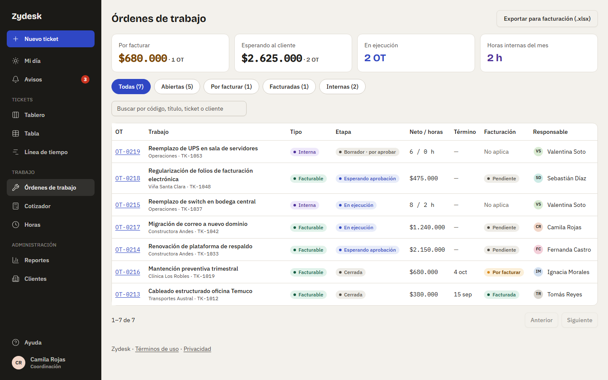

Arriba hay cuatro **indicadores**: **Por facturar** (OT cerradas pendientes de factura), **Esperando al cliente** (OT con cotización enviada y sin respuesta), **En ejecución** y **Horas internas del mes** (horas registradas en OT internas este mes). Cada uno es un enlace que deja la lista filtrada; "Esperando al cliente" filtra por la etapa Cotizada. Los montos en pesos solo los ven Administración, Coordinación y Solo lectura ("Ver reportes y montos"); los técnicos ven «—».

En la columna **Etapa**, una OT facturable Cotizada con cotización enviada se muestra como **Esperando aprobación**, y una interna en Borrador con aprobador asignado como **Borrador · por aprobar**. El botón **Exportar para facturación (.xlsx)** es de Coordinación y Administración ([manual de coordinación](02-coordinacion.md#exportar-para-facturación-xlsx)).

## Línea de tiempo

**Línea de tiempo** (menú, grupo Tickets; `/tickets/linea-de-tiempo`) responde "¿en qué está cada uno?": una columna por **día hábil** según el horario y los feriados de tu departamento (sin departamento, lunes a viernes) y una barra por ticket desde su inicio (inicio planificado o creación) hasta su fecha límite. La columna de hoy va destacada.

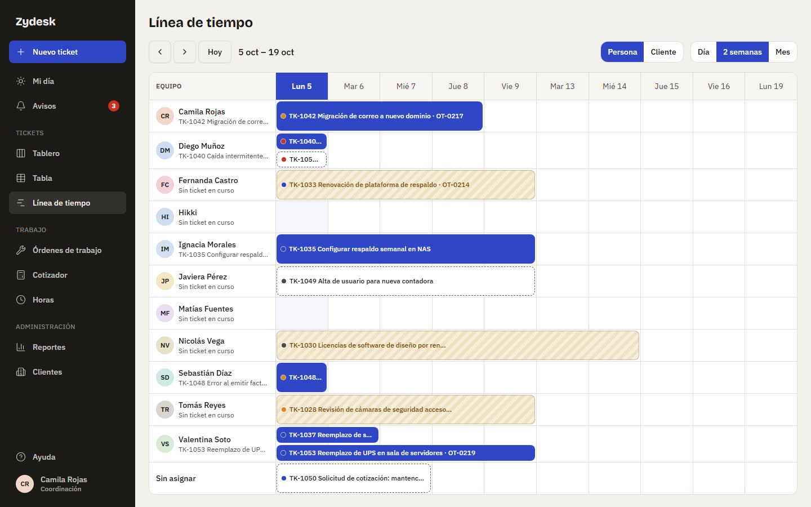

- **Escala**: **Día** (una columna), **2 semanas** (10 días hábiles desde el lunes) o **Mes**. Las flechas mueven el rango y **Hoy** vuelve al actual. El rango va en la dirección de la página, así que se puede compartir.
- **Agrupar por**: **Persona** (una fila por persona activa, tú primero; a la izquierda, su ticket En curso más reciente como "lo que hace ahora", o "Sin ticket en curso"; al final, "Sin asignar") o **Cliente** (una fila por cliente o área interna, y "Sin cliente").
- **Barras**: el estilo depende del estado (en curso lleno, nuevo punteado, en espera rayado, resuelto gris) y el punto del color de la prioridad. Muestran código, asunto y la OT vinculada si la hay. Una barra **vencida** se prolonga hasta hoy con borde punteado y un triángulo; un ticket **sin fecha límite** ocupa una sola columna con "sin fecha". Varios tickets que se solapan en una fila se apilan. Cada barra abre el ticket.
- **N vencidos**: el aviso superior cuenta los tickets vencidos del equipo; al pulsarlo quedan solo esas barras. Los vencidos abiertos aparecen aunque su fecha límite sea anterior al rango.

Es una vista de solo lectura; en el celular se desplaza hacia el lado con la columna de nombres fija. Los tickets archivados no aparecen.

## Cotizar una OT

Una OT **facturable** con cliente externo se cotiza dentro de la app, en **Borrador** o **Cotizada**. Pueden cotizar quienes editan tickets (Administración, Coordinación y Técnicos); **Solo lectura** ve y descarga, pero no edita.

### Crear la cotización

En la OT pulsa **Crear cotización** (en el encabezado o en la tarjeta **Cotización**). Nace la versión 1 en **Borrador**, con el código de la OT (`OT-0218` → `COT-0218 v1`), el contacto de la OT, la fecha de hoy, la validez, el IVA y las condiciones comerciales por defecto que fijó Administración, en pesos y sin líneas. Se abre el **Cotizador**. Si ya hay un borrador, el botón dice **Revisar y enviar cotización**.

### El Cotizador

- **Datos**: contacto del cliente (los que aprueban cotizaciones llevan la marca "aprueba"), fecha de emisión, validez (**15 o 30 días**; se muestra "Vence el …"), moneda **CLP** o **UF** (con UF debes escribir el **valor de la UF** del día; la app no lo consulta), la casilla **Aplica IVA** (con el porcentaje vigente al crear la cotización), **Condiciones comerciales** (van en la planilla y el PDF) y **Nota interna** (solo el equipo la ve; nunca va en los documentos).
- **Líneas**: tipo (Mano de obra, Material, Servicio, Traslado), descripción, cantidad, unidad (h, un, km, gl), precio unitario, descuento % y total. **Agregar línea** crea una de mano de obra a la tarifa de hora normal. Hasta 100 líneas.
- **Totales**: subtotal, descuentos, **neto**, IVA (o "Exento") y **total**, al vuelo mientras editas. En pesos se redondea a enteros y en UF a dos decimales, línea por línea. Al **Guardar**, la API vuelve a calcular y lo que ves es lo que queda. En pantallas angostas los totales quedan fijos al pie y cada línea es una tarjeta.
- **Versiones**: a la derecha, todas las versiones de la OT con su estado y total; cada una se abre.

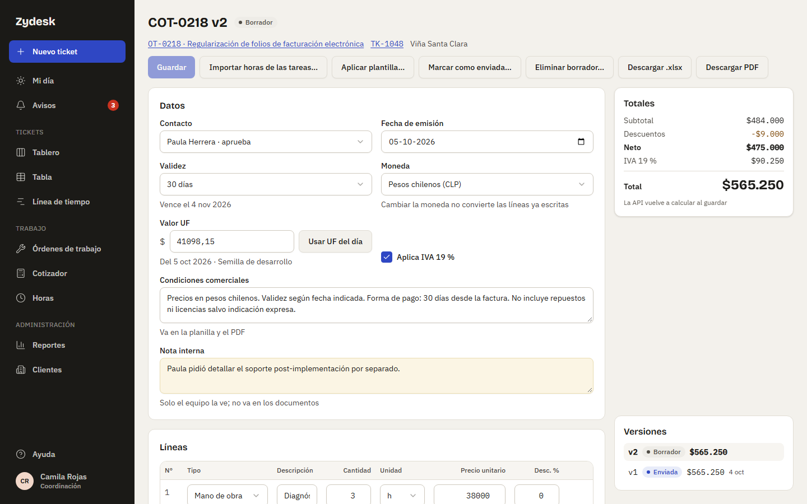

Con cambios sin guardar, **Importar horas**, **Aplicar plantilla** y **Marcar como enviada** piden guardar primero.

### Importar horas de las tareas

**Importar horas de las tareas…** agrega una línea de mano de obra por cada tarea de la OT con horas, con el título de la tarea como descripción. Eliges el origen: **estimadas** (por defecto), **reales** o **registradas** (las de la planilla de horas). El precio es la tarifa de **hora normal** del cliente o, si no tiene, la global; el diálogo te dice cuál usará. Si ninguna está definida, la app pide configurarla (Administración, en **Configuración → Tarifas**). Con **registradas**, las horas marcadas **fuera de horario** van en una línea aparte ("Diagnóstico (fuera de horario)") a la tarifa de **hora extendida**, que debe estar definida si hay horas de ese tipo; las horas registradas sin tarea van en la línea "Horas registradas sin tarea". No se puede importar en una cotización en UF (las tarifas están en pesos).

### Aplicar una plantilla

**Aplicar plantilla…** agrega las líneas de una plantilla de Administración. Las líneas sin precio toman la tarifa vigente (hora normal para `h`, traslado para `km`; materiales y gastos quedan en 0 para completarlos a mano). Si la cotización no tenía condiciones comerciales y la plantilla sí, se copian.

### Descargar el documento

**Descargar .xlsx** y **Descargar PDF** generan el documento al momento (`COT-0218_v1.xlsx`; con `-BORRADOR` si aún no se envió). La planilla trae fórmulas, de modo que el cliente puede revisarla; ambos llevan las condiciones comerciales y **nunca la nota interna**. Cada descarga queda en el historial de la OT y en el registro de seguridad; el documento no se guarda como archivo de la OT porque se regenera igual cada vez.

### Marcar como enviada

La app **no envía correos**: descarga el documento, envíalo al cliente y luego pulsa **Marcar como enviada…**. Exige al menos una línea y un contacto. Al confirmar:

- la cotización queda **Enviada** y ya no se edita;
- si la OT estaba en Borrador, pasa a **Cotizada**;
- si había una versión anterior enviada, queda **Reemplazada**.

Desde ahí, Coordinación registra la aprobación del cliente ([manual de coordinación](02-coordinacion.md)).

### Corregir: duplicar como v2

Una cotización enviada o rechazada no se edita: pulsa **Duplicar como v2** (o v3…). Se crea un borrador con los mismos datos y líneas, con la fecha de hoy y el mismo IVA de la original; la anterior conserva su estado hasta que envíes la nueva. Solo se duplica mientras la OT esté en Borrador o Cotizada: una cotización **aprobada** por el cliente queda congelada y no se duplica ni se cambia.

**Eliminar borrador…** borra el borrador vigente (las versiones enviadas nunca se borran). Si era la única cotización, la OT vuelve a mostrar **Crear cotización**.

### Lista de cotizaciones

**Cotizador** en el menú abre `/cotizaciones`, una vista de solo lectura con los filtros **Todas**, **Borradores**, **Enviadas** y **Aprobadas**, búsqueda por código, OT o cliente, y las columnas cotización, OT, cliente, emisión, vencimiento, estado, neto y total. Muestra solo la versión vigente de cada OT; las anteriores se abren desde el panel de versiones del Cotizador.

## Tablero

**Tickets** abre el **Tablero**, una vista de solo lectura con cuatro columnas: **Nuevo**, **En curso**, **En espera** y **Cerrados**. No se arrastra nada: cada tarjeta es un enlace al detalle del ticket, donde se cambia el estado. La tarjeta muestra código, prioridad, asunto, cliente, si tiene correo, de quién se espera (En espera), responsables, fecha límite y cantidad de mensajes. En **Cerrados** cada tarjeta indica el tipo de cierre: Resuelto, Descartado con su motivo, o Duplicado de otro ticket.

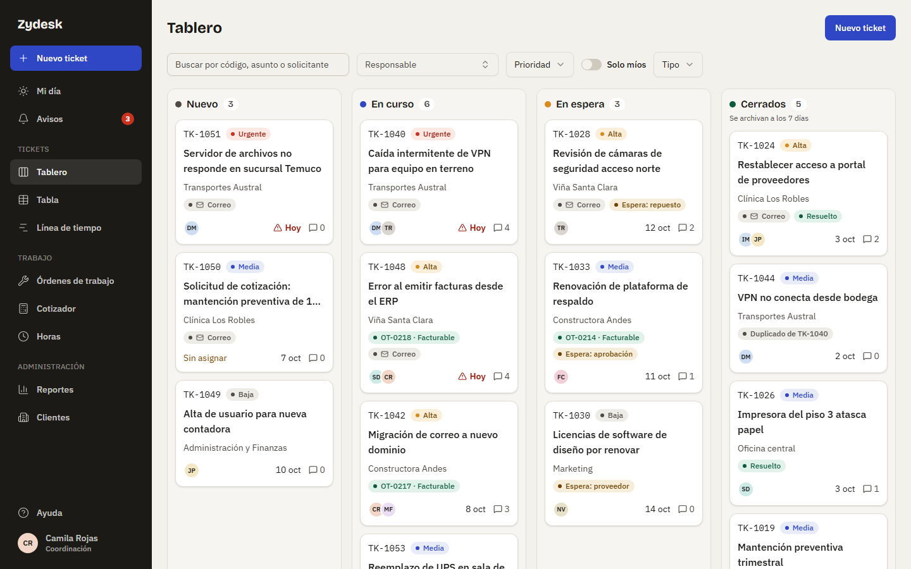

Puedes buscar por texto, filtrar por responsable, prioridad y **Tipo** (Ticket, OT facturable, OT interna), y activar **Solo míos** (tickets donde eres responsable o seguidor). Los filtros quedan en la dirección de la página, así que puedes compartirla. En pantallas angostas las columnas se desplazan hacia el lado.

## Tabla

**Tabla** muestra los mismos tickets en filas. Arriba hay filtros rápidos con contador: **Todos**, **Míos**, **Sin asignar**, **Vencen hoy**, **Vencidos**, **Con OT** y **Archivados**. Puedes buscar por código (`1048` o `TK-1048`) o por texto, **agrupar** por prioridad, estado, responsable, cliente, tipo o sin agrupar, y ordenar por **Vence**, **Prioridad** o **Actualizado**. También es de solo lectura: cada fila abre el ticket.

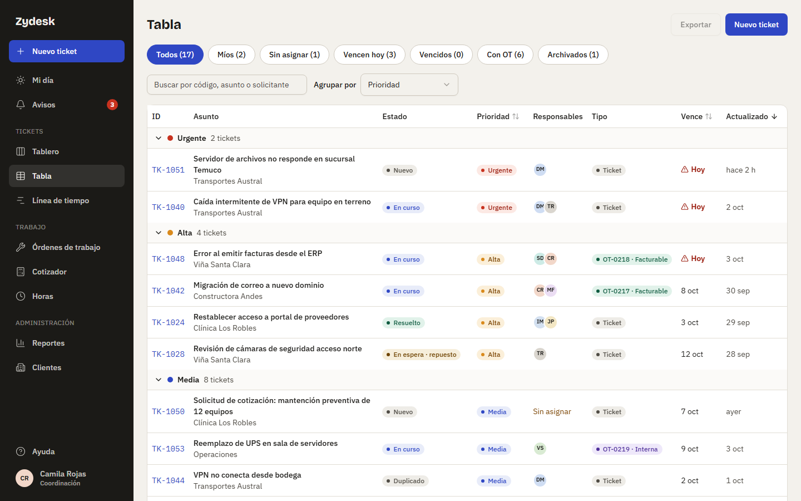

## Archivado a los 7 días

Un ticket cerrado se **archiva automáticamente** a los 7 días (una tarea nocturna lo hace). Desaparece del Tablero pero sigue en la Tabla, en el filtro **Archivados**, y se puede abrir y leer. Sigue aceptando seguimientos y notas. Si lo **reabres**, vuelve al Tablero en En curso. El historial muestra "El sistema archivó el ticket".
