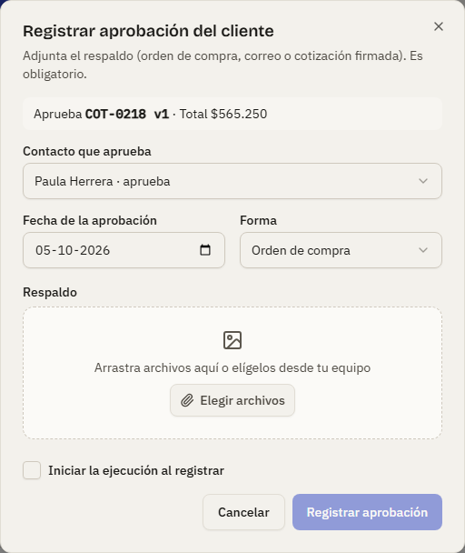
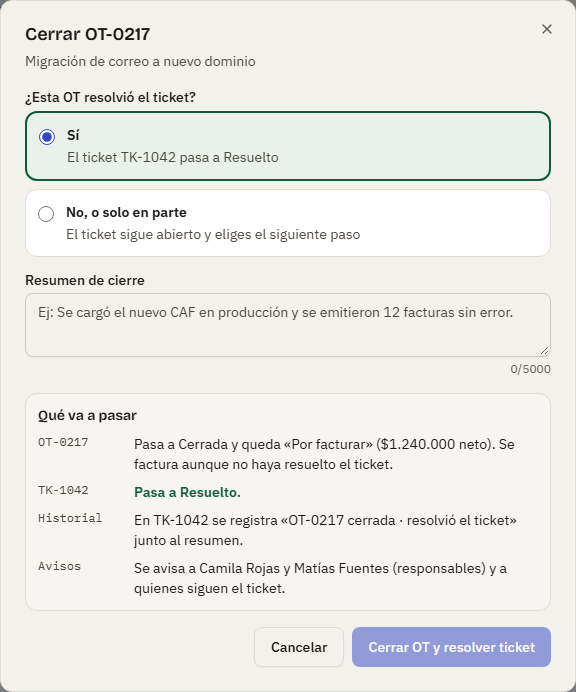
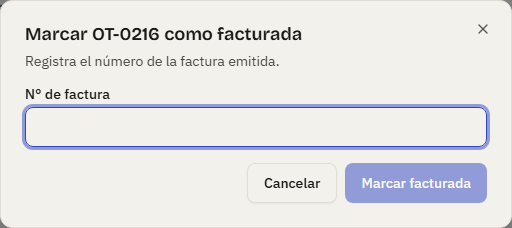
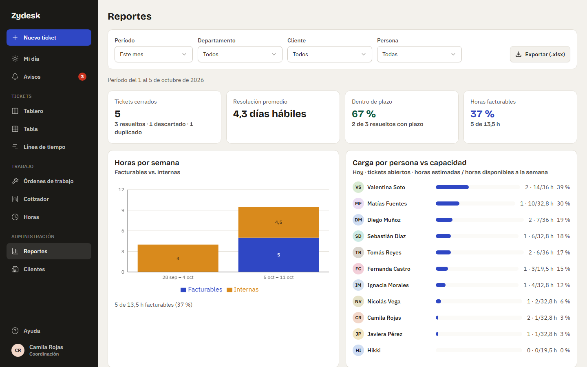

# Manual de coordinación: aprobar, cerrar y facturar OT

Esta guía es para quienes tienen rol **Coordinación** o **Administración**. Son las personas que aprueban las órdenes de trabajo (OT), las cierran, las cancelan y las marcan como facturadas. Cómo se crea una OT y cómo se trabaja en ella está en el [manual de tickets para el equipo](01-tecnico.md). Un Técnico ve estos botones ausentes; quien tiene **Solo lectura** puede ver todo pero no cambiar nada.

## Aprobar una OT interna

Una OT **interna** (no se factura) en **Borrador** muestra dos botones:

- **Aprobar e iniciar**: la aprueba y pasa directo a **En ejecución**.
- **Solo aprobar**: la deja **Aprobada**; después se inicia con **Iniciar ejecución**.

Al crear o editar la OT se indica **quién aprueba**: es a quien se le pide, pero **cualquier persona con permiso de aprobar puede hacerlo**. El historial deja registrado quién aprobó realmente.

## Registrar la aprobación del cliente (OT facturable)

Una OT facturable en **Cotizada** espera la aprobación del cliente. Cuando el cliente responde:

1. Pulsa **Registrar aprobación del cliente…**.
2. Elige el **contacto** del cliente que aprobó (debe ser un contacto activo de ese cliente), la **fecha** y la **forma**: orden de compra, correo de aprobación o cotización firmada.
3. Sube el **respaldo** (la orden de compra, el correo o el documento firmado). **Es obligatorio**: sin respaldo no se puede registrar. El archivo queda en **Fotos y archivos** de la OT ("respaldo de aprobación").
4. Opcionalmente marca **iniciar** para pasar de una vez a **En ejecución**. Pulsa registrar.

Una OT solo se aprueba una vez. Si el cliente rechaza la cotización, usa **Volver a borrador**.

### Aprobación con cotización

Desde la Fase 4 la OT llega a Cotizada solo cuando alguien marca una cotización como enviada (ver [Cotizar una OT](01-tecnico.md#cotizar-una-ot)); la marca manual "Marcar como cotizada" ya no existe.

- **Qué exige**: la cotización vigente de la OT debe estar **Enviada**. Si no hay cotización, o la vigente es un borrador (por ejemplo una v2 en preparación), el botón está deshabilitado con el aviso "Primero marca la cotización como enviada": hay que enviarla o eliminar el borrador. El diálogo muestra qué se aprueba ("Aprueba COT-0218 v1 · Total $565.250") y preselecciona el contacto de la cotización.
- **Qué se congela**: al registrar la aprobación, la cotización queda **Aprobada**: no se edita, no se duplica y no se crea otra para esa OT. Es el monto que verán la lista de OT (columna Neto), el cierre ("$1.240.000 neto") y la facturación. La única salida es cancelar la OT; la cotización aprobada queda como historial.
- **Qué pasa al volver a borrador**: si el cliente rechaza, **Volver a borrador** marca la cotización enviada como **Rechazada** (la app te lo advierte) y la OT vuelve a Borrador. El equipo la duplica como v2, la corrige y la envía de nuevo. Si la vigente era un borrador, no se toca.

## Descargas e historial

Cualquier persona con sesión puede descargar la cotización en `.xlsx` o PDF desde el Cotizador, también en Solo lectura. Cada descarga queda en el **Historial** de la OT ("descargó COT-0218 v1 en .xlsx") y en el registro de seguridad de Administración; los documentos no se guardan como archivos de la OT, se regeneran iguales cada vez. El historial de la OT registra además quién creó, envió, duplicó o eliminó cada versión, cada cambio de datos o líneas (con el neto y el total antes y después), y la aprobación o el rechazo del cliente.

## Cerrar una OT

Una OT en **En ejecución** muestra **Cerrar OT…**. El diálogo pregunta:

1. **¿Esta OT resolvió el ticket?**
   - **Sí**: el ticket pasa a **Resuelto**. No está disponible si el ticket tiene otras OT abiertas: el diálogo las nombra; ciérralas o cancélalas primero.
   - **No, o solo en parte**: el ticket sigue abierto y eliges **qué pasa con él**:
     - **Vuelve a En curso**.
     - **Pasa a En espera**: indica de quién se espera (cliente, proveedor, repuesto o aprobación) y un detalle opcional.
     - **Se crea una nueva OT vinculada**: nace en Borrador con el mismo tipo y datos, y recibe las tareas pendientes de la OT que cierras. El ticket vuelve a En curso.

     En los tres casos eliges el **responsable del siguiente paso** (por defecto, el responsable principal del ticket). Pasa a ser el responsable principal del ticket; quien lo era queda como colaborador. Con la nueva OT, es su responsable técnico.
2. **Resumen de cierre** (obligatorio, hasta 5.000 caracteres): qué se hizo y cómo quedó.
3. **Qué va a pasar**: la app te muestra, antes de confirmar, qué le ocurrirá a la OT, al ticket, al historial y a quién se avisará. Léelo: cambia según tus respuestas.

Pulsa **Cerrar OT y resolver ticket** o **Cerrar OT (ticket sigue abierto)**. Todo ocurre junto: si algo falla, no se cambia nada.

Qué queda después:

- La OT queda **Cerrada**. Si es facturable pasa a **Por facturar** (**aunque no haya resuelto el ticket**); si es interna, no se factura. Si no tenía fecha de término, se fija la de hoy.
- El resumen queda como seguimiento de la OT y **también en el ticket** ("Cierre de OT-0218" en su actividad), junto con el registro "OT-0218 cerrada · resolvió el ticket" (o "no resolvió el ticket") en el historial.
- Con la nueva OT, un aviso con enlace te lo indica ("OT-0220 creada").
- Los responsables y seguidores del ticket reciben el aviso "OT-0218 se cerró · resolvió el ticket TK-1048" (o "· el ticket TK-1048 sigue abierto"); si la OT es facturable, quienes pueden facturar reciben además "OT-0218 se cerró y quedó lista para facturar". No se envían avisos separados por el cambio de estado ni de responsable del ticket.

## Datos comerciales y horas tras la aprobación

Una vez aprobada la OT, solo Coordinación y Administración pueden cambiar la **OC del cliente**, la **condición de pago** y **Descuenta de la bolsa**; el resto de los datos los siguen editando los técnicos. En una OT cerrada o cancelada se pueden escribir mensajes, pero ya no se registran horas.

## Ver las horas del equipo

Coordinación y Administración tienen el permiso **Ver horas de todo el equipo**. En **Horas**, el selector de persona (arriba, junto a la semana) muestra a las personas activas; al elegir a otra aparece "Estás viendo la planilla de … · solo lectura": ves sus filas, celdas, totales y resumen frente a su jornada, pero no puedes escribir ni borrar nada (cada persona corrige sus propias horas). También se puede ver la planilla de una persona desactivada, como historial. Cómo se registran y corrigen las horas está en [Registrar horas](01-tecnico.md#registrar-horas).

Dónde se ven las horas acumuladas:

- **OT**: la tarjeta **Horas** del panel suma las registradas, y cada tarea muestra las suyas en la columna **Reg.**. En una OT interna, la tarjeta **Costo interno** multiplica las horas registradas por la tarifa de costo interno.
- **Ficha del cliente**: la tarjeta **Bolsa de horas** muestra "12,5 / 20 h usadas este mes" para el contrato vigente (en rojo si supera la bolsa), sumando las horas registradas en las OT que descuentan de esa bolsa en el mes en curso. La OT muestra la misma cifra junto a la casilla **Descuenta de la bolsa**.
- **Cotizador**: **Importar horas** con origen **registradas** lleva las horas de la planilla a la cotización, con las de fuera de horario a tarifa extendida; si la tarifa está en UF y la cotización en pesos (o al revés), el precio se convierte con el **valor UF guardado en esa cotización**. Las sumas en pesos de la lista de **Órdenes de trabajo**, de **Por facturar** y de **Reportes** usan ese mismo valor guardado, así que no cambian cuando cambia la UF del día.

## Cancelar una OT

Mientras una OT no esté cerrada ni cancelada, **Cancelar OT…** pide un **motivo obligatorio**. La OT queda **Cancelada** (se muestra tachada), no se factura aunque fuera facturable, sus tareas pendientes se quedan en ella y el ticket registra "canceló OT-0218" con el motivo. El estado del ticket no cambia. Una OT cancelada ya no cuenta como abierta: deja de impedir que se cierre el ticket.

## Marcar una OT como facturada

Una OT facturable cerrada aparece como **Por facturar** (en la lista, el filtro **Por facturar** las reúne). Cuando emites la factura, abre la OT, pulsa **Marcar facturada…** e ingresa el **N° de factura**. Pasa a **Facturada**, con número, fecha y quién la marcó; el stepper muestra "Facturada" como último paso. Solo se puede marcar una OT que esté por facturar, y solo una vez.

## Por aprobar en Mi día

En **Mi día**, el cuadro y la lista **Por aprobar** aparecen solo para quien tiene permiso de aprobar (Coordinación y Administración). Lista las OT **internas en Borrador** donde tú eres la persona elegida como "quién aprueba", con el título, "interna · N h estimadas" y el responsable técnico. **Revisar** abre la OT: la aprobación se hace ahí, no desde la lista. Además recibes el aviso "Valentina Soto te pidió aprobar la OT-0219 (interna)" cuando te la asignan; si tienes Telegram vinculado, ese aviso llega con el botón **Aprobar OT**, que la aprueba sin iniciar la ejecución (ver el [manual del bot](04-bot-telegram.md#aprobar-una-ot-desde-el-botón)). La aprobación del cliente sigue siendo solo desde la web, porque exige el respaldo adjunto.

## Avisos de facturación

Quien puede marcar OT como facturada (Coordinación y Administración) recibe el aviso **"OT cerrada y lista para facturar"** cada vez que se cierra una OT facturable ("OT-0216 se cerró y quedó lista para facturar · Clínica Los Robles"; sin el monto). También llega **"Cotización aprobada o rechazada"** a los responsables y seguidores del ticket cuando se registra la respuesta del cliente. Ambos se pueden apagar en las preferencias de **Avisos**.

## Exportar para facturación (.xlsx)

En **Órdenes de trabajo**, el botón **Exportar para facturación (.xlsx)** descarga una planilla con las OT que cumplen los filtros vigentes (chip, búsqueda, cliente y etapa), sin paginar: `ots-facturacion-AAAA-MM-DD.xlsx`. Columnas: OT, Título, Cliente, Ticket, Tipo, Etapa, Estado de facturación, N° factura, Cotización vigente (`COT-0218 v1`), Neto CLP, Horas registradas, Responsable, Inicio, Término y Cerrada el; al pie, los totales de neto y horas con fórmula. Los textos van siempre como texto (un título que empiece con `=` no se convierte en fórmula).

Uso típico a fin de mes: chip **Por facturar** y exportar. Exige permiso de facturar (Coordinación y Administración); para los demás roles el botón queda deshabilitado. Cada exportación queda en el registro de seguridad de Administración (solo con los nombres de los filtros usados, sin montos). Si los filtros abarcan más de 5.000 OT, la app pide acotarlos. **Marcar facturada** sigue haciéndose desde cada OT.

## Reportes

**Reportes** (menú lateral; en el celular, **Más → Reportes**) reúne las cifras del equipo. Lo ven Administración, Coordinación y Solo lectura ("Ver reportes y montos"); los técnicos no tienen la entrada en el menú.

Arriba, los **filtros**: **Período** (Este mes por defecto; Mes anterior; Últimos 30 o 90 días; Personalizado con dos fechas, hasta un año), **Departamento**, **Cliente** y **Persona**. Un texto bajo los filtros resume lo que estás viendo ("Período del 1 al 4 de octubre de 2026 · Soporte TI") y la URL guarda los filtros, así que puedes compartirla.

Qué mide cada parte:

- **Tickets cerrados**: los que se cerraron dentro del período (resueltos, descartados y duplicados, también los ya archivados). Un ticket reabierto deja de contar hasta que se cierre otra vez.
- **Resolución promedio**: días hábiles entre la creación y el cierre de los tickets **resueltos** en el período, según el horario y los feriados del departamento del **responsable principal** (si no tiene, el del responsable por defecto de la categoría). Cada día cuenta por la fracción de jornada trabajada: un ticket abierto y cerrado a la misma hora en dos días hábiles seguidos vale 1,0 día; un viernes corto o un feriado pesan lo que corresponde. Si algún ticket no tiene departamento con el que calcular, la tarjeta indica "n sin calendario" y ese ticket no entra en el promedio.
- **Dentro de plazo**: de los resueltos en el período que tenían fecha límite, cuántos se cerraron **antes o en** su fecha límite. Los descartados y duplicados no se miden contra un plazo.
- **Horas facturables**: de las horas registradas en la planilla con fecha en el período, qué parte está en OT facturables; el resto (tickets, OT internas y "Sin ticket") es interno.
- **Horas por semana**: las mismas horas, apiladas por semana (lunes a domingo) en facturables e internas, con el total sobre cada barra. En pantallas angostas se muestran solo las últimas 8 semanas; exporta para ver todas.
- **Carga vs capacidad**: una fila por persona activa, con sus **tickets abiertos** (como responsable principal o colaborador) y sus **horas estimadas**: las de los tickets abiertos donde es principal más las de las tareas de OT pendientes a su nombre, frente a su **capacidad semanal** (la jornada del departamento × el % de tiempo disponible para tickets que fija Administración). "2 · 14/33 h" se lee "2 tickets abiertos, 14 h estimadas de 33 h disponibles"; sobre el 100 % el número va en rojo. Es una foto de **hoy**, no del período.
- **Resolución por prioridad**: para Urgente, Alta, Media y Baja, el promedio de días hábiles de los resueltos del período frente al **objetivo** (el promedio de los plazos de resolución de sus categorías, en días hábiles). "Sobre plazo" en rojo cuando el promedio supera el objetivo.
- **Tabla por cliente**: una fila por cliente externo con **abiertos** (hoy), **cerrados** y **horas** del período, **facturado** (neto de las OT marcadas facturadas en el período) y **por facturar** (neto de las OT cerradas que hoy faltan cobrar, destacado en ámbar). Las áreas internas van agrupadas en una sola fila **Interno** y los tickets sin cliente en **Sin cliente**, ambas sin montos. Los montos son el neto de la cotización aprobada de cada OT.

Con un filtro de departamento o persona, los tickets se atribuyen por su responsable principal, las horas por quien las registró y los montos por el responsable técnico de la OT. Si el período es inválido (fin antes del inicio, más de un año o un filtro que ya no existe) el mensaje aparece bajo los filtros.

**Exportar (.xlsx)** descarga `reportes-AAAA-MM-DD_AAAA-MM-DD.xlsx` con cinco hojas (Resumen, Horas por semana, Carga vs capacidad, Resolución por prioridad y Por cliente) con las mismas cifras que la pantalla y totales al pie. Cada exportación queda en el registro de seguridad de Administración (solo con los nombres de los filtros usados, sin montos). Los nombres van siempre como texto.

## Resolver un ticket que tiene una OT abierta

Un ticket con una OT abierta no se puede resolver, descartar ni marcar como duplicado directamente: la app muestra la lista de OT abiertas con su etapa. Tienes dos caminos:

- Cierra la OT desde **Cerrar OT…** con **Sí** (resuelve el ticket en el mismo paso).
- O cancela la OT que ya no corresponde y luego cambia el estado del ticket.

## Lo que todavía no está

La cotización no se envía por correo desde la app (se descarga y se envía fuera) y el PDF no lleva los datos de la empresa. Las horas de otra persona se ven pero no se editan, y no hay cierre de mes ni exportación de la planilla de horas en bruto (Reportes exporta las horas agregadas por semana). Reportes no mide el tiempo de primera respuesta ni separa las horas de bolsa de las horas a cotizar por cliente. El bot de Telegram no registra la aprobación del cliente ni "Marcar facturada".
